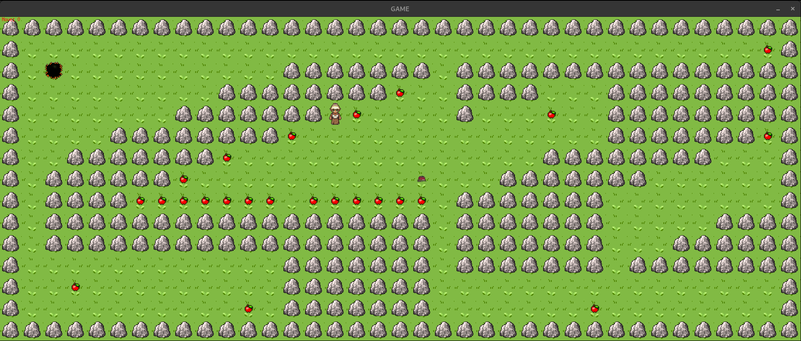

## Projet SO_LONG

* [Introduction](#introduction)
* [Utilisation](#utilisation)
* [liens](#liens)

## Introduction

Le [projet](./resources/fr.subject.pdf) est de créer un jeu 2D en utilisant la bibliothèque graphique [MinilibX](https://harm-smits.github.io/42docs/libs/minilibx/images.html) et le langage C.
Ce projet est un jeu simple où le joueur doit collecter tous les objets de la carte et atteindre la sortie, le joueur ne peut se déplacer que horizontalement et verticalement, la carte est composée de murs, d'espaces vides, d'objets à collectionner et la sortie, le joueur perd s'il entre en collision avec un ennemi.

## Utilisation

> Premièrement assurez-vous d'avoir bien telecharge la [Minilibx](https://github.com/42Paris/minilibx-linux) pour ensuite la mettre a la racine de votre projet.

Donc clonez le projet, et faites un `make` une fois la Minilibx a la racine du dossier :

`cd so_long`

`cp <chemin_dossier_Minilibx>/minilibx-linux .`

`make`

Pour lancer le programme exécutez `./so_long` suivi de la map a afficher (elles se trouvent dans le dossier `/maps`) :

`./so_long maps/42.ber`

Libre a vous de créer vos propres maps du moment qu'elles respectent les règles suivantes :

- la map doit être rectangulaire et entourée de murs (représentés par des **1**)
- la map doit contenir un personnage **P**, des collectibles **C**, un ennemi au moins **B** et une sortie **E**
- les collectibles et la sortie doivent être accessibles

Voici quelques exemples de maps :

  

  

  

## liens

https://anyconv.com/fr/convertisseur-de-png-en-xpm

https://harm-smits.github.io/42docs/libs/minilibx/images.html

https://github.com/42Paris/minilibx-linux

