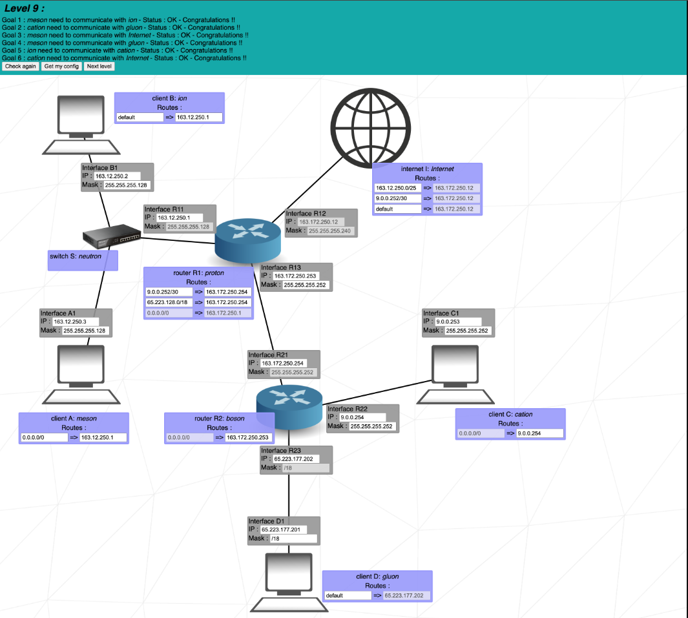
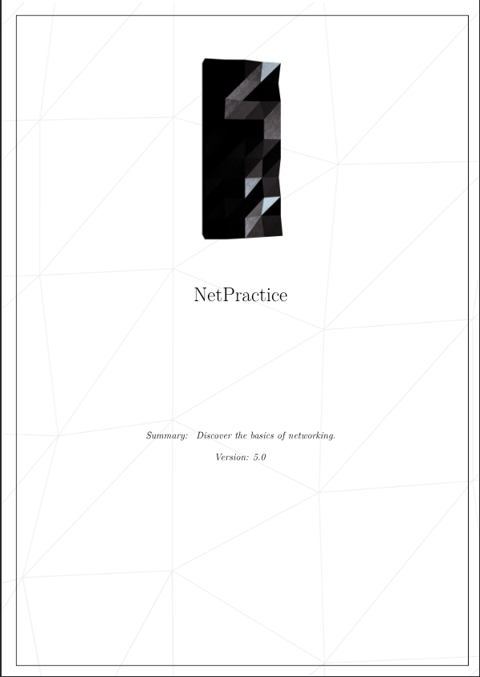

# Projet NETPRACTICE

<p align="center">
  
</p>

## Sommaire :
* Introduction
* Concepts clés
* Utilisation
* Ressources
* Liens

<p>&nbsp;</p>

## Introduction

Le projet **NetPractice** est un exercice pratique pour comprendre les bases du **réseau TCP/IP** et de l'**adressage IP**. 

L'objectif est de résoudre 10 niveaux de configuration réseau en corrigeant les adresses IP, les masques de sous-réseau et les routes pour que les réseaux communiquent correctement.

### Objectifs principaux

- Comprendre le fonctionnement de l'**adressage IPv4**
- Maîtriser les **masques de sous-réseau** (subnet masks)
- Apprendre la **notation CIDR** (/24, /25, etc.)
- Configurer des **routes réseau**
- Résoudre des problèmes de **connectivité réseau**

<p>&nbsp;</p>

## Concepts clés

### Adresse IP

Une adresse IP (IPv4) est composée de **4 octets** (32 bits) :
```
192.168.1.1
```

Chaque octet peut aller de **0 à 255**.

### Masque de sous-réseau

Le masque de sous-réseau détermine quelle partie de l'adresse IP identifie le **réseau** et quelle partie identifie l'**hôte** :

```
IP:      192.168.1.10
Masque:  255.255.255.0  (ou /24)
         └──réseau──┘ └hôte┘
```

### Notation CIDR

La notation CIDR (Classless Inter-Domain Routing) indique le nombre de bits réservés au réseau :

```
/24 = 255.255.255.0    → 256 adresses (254 utilisables)
/25 = 255.255.255.128  → 128 adresses (126 utilisables)
/30 = 255.255.255.252  → 4 adresses (2 utilisables)
```

### Classes de réseaux

| Classe | Plage | Usage |
|--------|-------|-------|
| **A** | 10.0.0.0 - 10.255.255.255 | Réseaux privés |
| **B** | 172.16.0.0 - 172.31.255.255 | Réseaux privés |
| **C** | 192.168.0.0 - 192.168.255.255 | Réseaux privés |

<p>&nbsp;</p>

## Subnet Mask Chart

|Subnet Mask 	|CIDR |	Binary Notation| 	Network Bits| 	Host Bits| 	Available Addresses|
| -           | -   | -              | -            | -          | -                   | 
|255.255.255.255| 	/32| 	11111111.11111111.11111111.11111111| 	32| 	0| 	1|
|255.255.255.254| 	/31| 	11111111.11111111.11111111.11111110| 	31| 	1| 	2|
|255.255.255.252| 	/30| 	11111111.11111111.11111111.11111100| 	30| 	2| 	4|
|255.255.255.248| 	/29| 	11111111.11111111.11111111.11111000| 	29| 	3| 	8|
|255.255.255.240| 	/28| 	11111111.11111111.11111111.11110000| 	28| 	4| 	16|
|255.255.255.224| 	/27| 	11111111.11111111.11111111.11100000| 	27| 	5| 	32|
|255.255.255.192| 	/26| 	11111111.11111111.11111111.11000000| 	26| 	6| 	64|
|255.255.255.128| 	/25|     11111111.11111111.11111111.10000000| 	25| 	7| 	128|
|255.255.255.0| 	/24| 	11111111.11111111.11111111.00000000| 	24| 	8| 	256|		
|255.255.254.0| 	/23| 	11111111.11111111.11111110.00000000| 	23| 	9| 	512|
|255.255.252.0| 	/22| 	11111111.11111111.11111100.00000000| 	22| 	10| 	1024|
|255.255.248.0| 	/21| 	11111111.11111111.11111000.00000000| 	21| 	11| 	2048|
|255.255.240.0| 	/20| 	11111111.11111111.11110000.00000000| 	20| 	12| 	4096|
|255.255.224.0| 	/19| 	11111111.11111111.11100000.00000000| 	19| 	13| 	8192|
|255.255.192.0| 	/18| 	11111111.11111111.11000000.00000000| 	18| 	14| 	16384|
|255.255.128.0| 	/17| 	11111111.11111111.10000000.00000000| 	17| 	15| 	32768|
|255.255.0.0| 	/16| 	11111111.11111111.00000000.00000000| 	16| 	16| 	65536|	
|255.254.0.0| 	/15| 	11111111.11111110.00000000.00000000| 	15| 	17| 	131072|
|255.252.0.0| 	/14| 	11111111.11111100.00000000.00000000| 	14| 	18| 	262144|
|255.248.0.0| 	/13| 	11111111.11111000.00000000.00000000| 	13| 	19| 	524288|
|255.240.0.0| 	/12| 	11111111.11110000.00000000.00000000| 	12| 	20| 	1048576|
|255.224.0.0| 	/11| 	11111111.11100000.00000000.00000000| 	11| 	21| 	2097152|
|255.192.0.0| 	/10| 	11111111.11000000.00000000.00000000| 	10| 	22| 	4194304|
|255.128.0.0| 	/9| 	11111111.10000000.00000000.00000000| 	9| 	23| 	8388608|
|255.0.0.0| 	    /8| 	11111111.00000000.00000000.00000000| 	8| 	24| 	16777216| 

<p>&nbsp;</p>

## Exemple pratique

### Analyse d'une configuration réseau

```
Address:   192.168.0.1           11000000.10101000.00000000.00000001
Netmask:   255.255.255.0 = 24    11111111.11111111.11111111.00000000
Wildcard:  0.0.0.255             00000000.00000000.00000000.11111111
=>
Network:   192.168.0.0/24        11000000.10101000.00000000.00000000 (Class C)
Broadcast: 192.168.0.255         11000000.10101000.00000000.11111111
HostMin:   192.168.0.1           11000000.10101000.00000000.00000001
HostMax:   192.168.0.254         11000000.10101000.00000000.11111110
Hosts/Net: 254                   (Private Internet)
```

**Explication :**
- **Network** : Adresse du réseau (première adresse)
- **Broadcast** : Adresse de diffusion (dernière adresse)
- **HostMin** : Première adresse utilisable pour un hôte
- **HostMax** : Dernière adresse utilisable pour un hôte
- **Hosts/Net** : Nombre d'hôtes possibles sur ce réseau

### Calcul rapide

Pour trouver le nombre d'hôtes dans un sous-réseau :

```
Formule : 2^(32 - CIDR) - 2

Exemple avec /24 :
2^(32-24) - 2 = 2^8 - 2 = 256 - 2 = 254 hôtes

Exemple avec /30 :
2^(32-30) - 2 = 2^2 - 2 = 4 - 2 = 2 hôtes
```

On retire **2 adresses** car :
- 1 pour l'adresse réseau
- 1 pour l'adresse broadcast

<p>&nbsp;</p>

## Utilisation

### Accès au training

1. Téléchargez le fichier d'entraînement depuis l'intra 42
2. Ouvrez le fichier `index.html` dans votre navigateur
3. Résolvez les 10 niveaux en configurant correctement les réseaux

### Comment résoudre un niveau

Pour chaque niveau :

1. **Analysez le schéma réseau** : Identifiez les machines, routeurs et réseaux
2. **Vérifiez les adresses IP** : Elles doivent être dans le même réseau pour communiquer
3. **Configurez les masques** : Utilisez le bon CIDR pour le nombre d'hôtes nécessaires
4. **Configurez les routes** : Assurez-vous que les paquets peuvent atteindre leur destination
5. **Testez la configuration** : Cliquez sur "Check again" pour valider

### Règles importantes

✅ Deux machines sur le **même réseau** doivent avoir :
- La même **partie réseau** dans leur adresse IP
- Le même **masque de sous-réseau**

✅ Pour communiquer entre **réseaux différents** :
- Il faut un **routeur** (passerelle)
- Les **routes** doivent être configurées correctement

✅ Adresses réservées à éviter :
- `0.0.0.0` : Adresse par défaut
- `127.x.x.x` : Loopback (localhost)
- `255.255.255.255` : Broadcast général
- Première adresse du réseau (adresse réseau)
- Dernière adresse du réseau (broadcast)

<p>&nbsp;</p>

## Ressources

### Outils utiles

**Calculateurs de sous-réseaux en ligne :**
- [ipcalc.co](https://ipcalc.co/)
- [subnet-calculator.com](https://www.subnet-calculator.com/)
- [calculator.net/ip-subnet-calculator](https://www.calculator.net/ip-subnet-calculator.html)

**Commandes réseau utiles :**
```bash
# Afficher la configuration réseau
ip addr
ifconfig

# Tester la connectivité
ping 192.168.1.1

# Afficher la table de routage
ip route
route -n

# Tracer le chemin des paquets
traceroute google.com
```

<p>&nbsp;</p>

## Astuces

### Méthode de résolution

1. **Commencez par les extrémités** : Configurez d'abord les machines clientes
2. **Remontez vers le centre** : Configurez ensuite les routeurs
3. **Vérifiez la cohérence** : Assurez-vous que tous les réseaux sont bien distincts
4. **Testez progressivement** : Validez chaque partie avant de passer à la suivante

### Erreurs fréquentes

❌ **Chevaucher deux réseaux** : Deux réseaux ne peuvent pas avoir la même plage d'adresses

❌ **Oublier la route par défaut** : Sans route, les paquets ne savent pas où aller

❌ **Utiliser une adresse réservée** : Broadcast, réseau ou loopback

❌ **Mauvais masque** : Un masque trop large ou trop petit empêche la communication

<p>&nbsp;</p>

## Liens

- [RFC 791 - Internet Protocol](https://tools.ietf.org/html/rfc791)
- [RFC 1918 - Private Address Space](https://tools.ietf.org/html/rfc1918)
- [Subnetting Tutorial (YouTube)](https://www.youtube.com/results?search_query=subnetting+tutorial)
- [IP Addressing and Subnetting Guide](https://www.cisco.com/c/en/us/support/docs/ip/routing-information-protocol-rip/13788-3.html)

---

<p>&nbsp;</p> 

<p align="center">
  <a href="./ressources/en.subject.pdf">
	
  </a>
</p>
