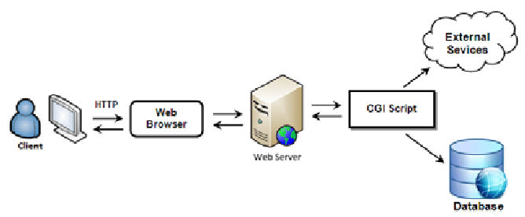

# Projet WEBSERV

<p>&nbsp;</p>

<p align="center">
  
</p>

## Sommaire :
- [I. Objectif](#i-objectif)
- [II. Parties principales](#ii-parties-principales)
  - **☀️ Partie obligatoire**
  - **☀️ Prérequis techniques**
  - **Bonus**
- [III. Criteres de reussite](#iii-criteres-de-reussite)
- [IV. Grandes Etapes](#iv-grandes-etapes)
- [V. CGI](#v-cgi)
	- **Fonctionnement de CGI**
	- **Exemple de flux CGI**
	- **Importance et Utilisation**
	- **Limites**
- [VI. HTTP](#vi-http)
- [VII. Sockets](#vii-sockets)

<p>&nbsp;</p>

# I. Objectif

Le but du projet [Webserv](./ressources/fr.subject.pdf) est de créer un serveur HTTP conforme au protocole HTTP/1.1. Ce serveur devra pouvoir être testé dans un véritable navigateur et respecter certaines contraintes spécifiques liées à la gestion des entrées/sorties non bloquantes.

<p>&nbsp;</p>

# II. Parties principales

1.  **Partie obligatoire**
    
    -   Développement du serveur HTTP avec C++98.
    -   Gestion des requêtes HTTP (GET, POST, DELETE).
    -   Le serveur doit être capable de traiter plusieurs connexions et rester performant sous pression (tests de charge).
    -   Il doit supporter le téléversement de fichiers et offrir une compatibilité avec les méthodes CGI pour l'exécution de scripts dynamiques (comme PHP).
    -   Un fichier de configuration permet de spécifier les hôtes, les ports, les routes, les pages d’erreur, etc.
2.  **Prérequis techniques**
    
    -   Utilisation de **poll()** ou équivalents (epoll, kqueue) pour la gestion des entrées/sorties non bloquantes.
    -   Limitation à certaines fonctions système pour les opérations réseau et de gestion des processus (ex : `execve`, `socket`, `bind`, etc.).
    -   Respect strict des normes C++98 et interdiction de l’utilisation de bibliothèques externes comme Boost.
3.  **Bonus (optionnel)**
    
    -   Gestion avancée des sessions et des cookies.
    -   Prise en charge de plusieurs CGI.

<p>&nbsp;</p>

# III. Criteres de reussite

-   Le serveur doit être capable de fonctionner sans interruption et être compatible avec un navigateur web. En cas de plantage ou de comportement inattendu, le projet sera invalidé.
-   La partie bonus n’est prise en compte que si toutes les fonctionnalités obligatoires sont parfaitement réalisées.

Ce projet nécessite une bonne compréhension des protocoles réseau, de la gestion des fichiers et des processus sous Unix, ainsi que des concepts de développement non bloquant.

<p>&nbsp;</p>

# IV. Grandes Etapes
Pour réaliser un projet comme **Webserv** (un serveur HTTP en C++98), il faut suivre plusieurs étapes structurées, allant de la conception initiale à l'implémentation et aux tests. Voici les grandes étapes de code pour ce projet :

### Compréhension des Spécifications

-   Lire et comprendre le sujet du projet, notamment les fonctionnalités obligatoires et les exigences techniques (utilisation de C++98, gestion des entrées/sorties non bloquantes, etc.).
-   Étudier le protocole HTTP/1.1 et ses spécifications, en particulier les méthodes GET, POST, DELETE, les codes de statut, et la gestion des en-têtes.

### Architecture du Serveur

-   **Décomposition en modules** : Découper le projet en modules ou classes, tels que :
    -   **Socket Server** : Gérer la création, l'écoute, et l'acceptation des connexions.
    -   **HTTP Request** : Analyser et comprendre les requêtes HTTP entrantes.
    -   **HTTP Response** : Générer les réponses HTTP appropriées.
    -   **CGI Handler** : Gérer l'exécution des scripts CGI.
    -   **Configuration Parser** : Lire et interpréter le fichier de configuration.
-   **Conception des classes** : Définir les classes avec leurs attributs et méthodes. Par exemple, une classe `HttpRequest` pourrait avoir des méthodes pour analyser les en-têtes et le corps de la requête.

### Initialisation du Serveur

-   **Socket et Liaison** : Créer un socket, le lier à une adresse IP et un port spécifiques (définis dans le fichier de configuration), et mettre le socket en mode écoute.
    
```
int server_fd = socket(AF_INET, SOCK_STREAM, 0);
bind(server_fd, (struct sockaddr*)&address, sizeof(address));
listen(server_fd, SOMAXCONN);
```
    
-   **Poll (ou équivalent)** : Mettre en place `poll()` (ou `select()`, `epoll()`, etc.) pour surveiller plusieurs descripteurs de fichiers, détecter les connexions entrantes, et gérer les opérations de lecture/écriture sans blocage.

### Gestion des Requêtes HTTP

-   **Accepter les connexions** : Lorsque `poll()` détecte une nouvelle connexion, l'accepter et ajouter le descripteur de fichier au set de descripteurs surveillés.
    
```
 int new_socket = accept(server_fd, (struct sockaddr*)&address, (socklen_t*)&addrlen);
```
    
-   **Lire les requêtes** : Lire la requête entrante via le socket, analyser les en-têtes et le corps de la requête.

```
char buffer[1024] = {0};
read(new_socket, buffer, 1024);
```
    
-   **Créer une réponse** : En fonction de la requête, générer une réponse HTTP appropriée (200 OK, 404 Not Found, etc.). Cela inclut la gestion des méthodes GET, POST, DELETE, et l'exécution des scripts CGI si nécessaire.

```
std::string http_response = "HTTP/1.1 200 OK\r\nContent-Type: text/html\r\n\r\n<html>...</html>";
write(new_socket, http_response.c_str(), http_response.length());
```

### Gestion des Entrées/Sorties Non Bloquantes

-   **Mise en place de `poll()`** : Utiliser `poll()` pour surveiller à la fois les opérations de lecture et d'écriture sur les sockets sans bloquer le serveur.
-   **Non-blocage** : Configurer les sockets pour qu'ils soient non-bloquants afin que le serveur reste réactif même sous une lourde charge.

### Gestion du Fichier de Configuration

-   **Analyse du fichier de configuration** : Écrire un parseur pour lire les paramètres de configuration (ports, routes, hôtes, etc.) et configurer le serveur en conséquence.
-   **Application des configurations** : Appliquer les configurations pour les différentes routes, les pages d'erreur personnalisées, les limitations de taille de corps, etc.

### Implémentation du CGI

-   **Exécution des scripts** : Lorsqu'une requête nécessite l'exécution d'un CGI (ex : script PHP), forker un nouveau processus pour exécuter le script et capturer sa sortie.

```
pid_t pid = fork();
if (pid == 0) {
	// Code enfant: exécuter le CGI
	execl("/usr/bin/php-cgi", "php-cgi", "script.php", NULL);
} else {
    // Code parent: récupérer la sortie du CGI
    waitpid(pid, &status, 0);
}
```

-   **Intégration avec HTTP** : Prendre la sortie du CGI, l'incorporer dans la réponse HTTP, et l'envoyer au client.

### Tests et Débogage

-   **Tests unitaires** : Écrire des tests pour vérifier chaque module (parsing des requêtes, génération des réponses, gestion des connexions, etc.).
-   **Tests de stress** : Simuler de lourdes charges pour s'assurer que le serveur reste stable.
-   **Comparaison avec NGINX** : Comparer les réponses du serveur avec celles d'un serveur comme NGINX pour s'assurer de la conformité.

### Optimisations et Bonus

-   **Optimisation des performances** : Améliorer la gestion des ressources et la rapidité du serveur.
-   **Implémentation des fonctionnalités bonus** : Ajouter la gestion des sessions, des cookies, ou d'autres fonctionnalités avancées.

<p>&nbsp;</p>

# V. CGI

Le **CGI** (Common Gateway Interface) est un standard qui permet à un serveur web d'interagir avec des programmes externes pour générer du contenu dynamique. Voici comment cela fonctionne et son rôle dans un serveur HTTP :

### Fonctionnement de CGI

1.  **Demande HTTP** :
    
    -   Lorsqu'un utilisateur envoie une requête HTTP pour une page web qui nécessite du contenu dynamique (par exemple, un formulaire de contact ou un script PHP), le serveur web ne peut pas simplement retourner un fichier statique comme il le ferait pour une image ou une page HTML. Il doit exécuter un programme ou un script pour générer ce contenu.
2.  **Exécution du programme CGI** :
    
    -   Le serveur web utilise CGI pour appeler un programme externe ou un script (comme un script Python, PHP, Perl, etc.). Ce programme est généralement situé sur le serveur lui-même.
    -   Le serveur passe les informations de la requête (telles que les données du formulaire, les variables d'environnement, etc.) au programme CGI via des variables d'environnement ou en utilisant l'entrée standard (stdin).
3.  **Réponse du programme** :
    
    -   Le programme CGI traite les données, effectue les calculs ou accède à une base de données si nécessaire, puis génère un contenu, généralement sous la forme de HTML.
    -   Ce contenu est renvoyé au serveur web via la sortie standard (stdout).
4.  **Transmission au client** :
    
    -   Le serveur web reçoit la sortie du programme CGI, qui inclut généralement des en-têtes HTTP suivis du contenu généré.
    -   Ce contenu est ensuite envoyé au navigateur de l'utilisateur comme réponse à la requête HTTP.

### Exemple de flux CGI

1.  L'utilisateur soumet un formulaire web.
2.  Le serveur reçoit la requête et la transmet à un script CGI, par exemple, `process_form.cgi`.
3.  `process_form.cgi` récupère les données du formulaire, traite les informations (comme stocker des données dans une base de données), et génère une page HTML de confirmation.
4.  Le serveur web envoie cette page générée au navigateur de l'utilisateur.

### Importance et Utilisation

-   **Simplicité** : CGI est l'un des moyens les plus simples d'ajouter du contenu dynamique à un site web.
-   **Portabilité** : Étant donné que CGI peut exécuter tout programme qui fonctionne en ligne de commande, il est très flexible et peut être utilisé dans différents environnements.
-   **Historique** : CGI est l'une des premières méthodes utilisées pour créer des pages web dynamiques, mais il a été largement remplacé par des technologies plus modernes comme les servlets, PHP, et les frameworks web.

### Limites

-   **Performance** : Chaque requête CGI implique le lancement d'un nouveau processus, ce qui peut être coûteux en termes de ressources système, particulièrement pour des serveurs à haute charge.
-   **Sécurité** : Si le programme CGI n'est pas bien sécurisé, il peut être vulnérable aux attaques, comme l'injection de commandes.

En résumé, CGI permet à un serveur web d'exécuter des programmes externes pour générer des réponses dynamiques, ce qui est crucial pour les applications web interactives.

<p>&nbsp;</p>

# VI. HTTP

HTTP/1.1 (Hypertext Transfer Protocol version 1.1) est une version améliorée du protocole HTTP, utilisée pour la communication sur le World Wide Web. Il a été introduit en 1997 pour améliorer les performances et la fiabilité par rapport à la version précédente, HTTP/1.0. Voici les concepts clés et les fonctionnalités de HTTP/1.1 :

### Communication Client-Serveur

-   **Client** : Généralement, un navigateur web qui envoie des requêtes HTTP pour accéder à des ressources (pages HTML, images, fichiers, etc.).
-   **Serveur** : Un serveur web qui reçoit les requêtes HTTP et envoie les réponses appropriées.

### Méthodes HTTP

HTTP/1.1 supporte plusieurs méthodes pour indiquer l'action que le client souhaite effectuer :

-   **GET** : Récupère une ressource depuis le serveur.
-   **POST** : Envoie des données au serveur, souvent pour soumettre des formulaires ou télécharger des fichiers.
-   **PUT** : Remplace une ressource existante ou en crée une nouvelle sur le serveur.
-   **DELETE** : Supprime une ressource sur le serveur.
-   **HEAD** : Similaire à GET, mais ne récupère que les en-têtes HTTP sans le corps de la réponse.
-   **OPTIONS** : Interroge le serveur pour savoir quelles méthodes HTTP sont supportées pour une ressource spécifique.
-   **TRACE** : Suit le chemin d'une requête à travers les différents serveurs pour déboguer.
-   **CONNECT** : Utilisé pour établir des tunnels, souvent pour HTTPS via un proxy.

### En-têtes HTTP

-   **En-têtes de requête** : Envoyés par le client pour fournir des informations supplémentaires avec la requête, comme `Host`, `User-Agent`, `Accept`, etc.
-   **En-têtes de réponse** : Envoyés par le serveur pour fournir des informations supplémentaires avec la réponse, comme `Content-Type`, `Content-Length`, `Set-Cookie`, etc.

### Connections Persistantes (Keep-Alive)

-   HTTP/1.1 permet de garder les connexions ouvertes entre les requêtes pour éviter de devoir établir une nouvelle connexion TCP pour chaque requête. Cela améliore les performances en réduisant la latence.
-   Par défaut, la connexion est maintenue ouverte après une réponse, sauf indication contraire par l'en-tête `Connection: close`.

### Pipelining

-   HTTP/1.1 introduit le pipelining, qui permet d'envoyer plusieurs requêtes sur une seule connexion TCP sans attendre la réponse de la requête précédente. Cela améliore l'efficacité, bien que certains serveurs et navigateurs ne le supportent pas bien.

### Gestion des Codes de Statut

-   Les codes de statut HTTP indiquent le résultat de la requête :
    -   **2xx Success** : Indique que la requête a été traitée avec succès (ex : 200 OK).
    -   **3xx Redirection** : Indique que le client doit prendre une action supplémentaire pour compléter la requête (ex : 301 Moved Permanently).
    -   **4xx Client Error** : Indique une erreur du côté du client (ex : 404 Not Found).
    -   **5xx Server Error** : Indique une erreur du côté du serveur (ex : 500 Internal Server Error).

### Prise en Charge de Cache

-   HTTP/1.1 améliore la gestion du cache avec des en-têtes comme `Cache-Control`, `ETag`, et `If-Modified-Since` pour optimiser le chargement des pages en évitant de télécharger à nouveau des ressources inchangées.

### Contrôle de Flux et Limitation

-   HTTP/1.1 permet le contrôle de flux avec des en-têtes comme `Content-Length` pour indiquer la taille du corps de la réponse, et `Transfer-Encoding: chunked` pour envoyer des données en morceaux lorsque la taille totale est inconnue au début.

### Gestion des Erreurs

-   HTTP/1.1 précise la manière dont les erreurs doivent être gérées et renvoyées au client, en permettant une gestion plus fine des cas comme les erreurs 404 (ressource non trouvée) ou 500 (erreur interne du serveur).

### Extensions et Personnalisation

-   HTTP/1.1 permet également l'utilisation d'en-têtes personnalisés et l'extension du protocole pour répondre à des besoins spécifiques, ce qui en fait une version flexible et extensible.

<p>&nbsp;</p>

# VII. Sockets

### Qu'est-ce qu'un Socket ?

Un **socket** est une interface de programmation réseau permettant la communication entre deux machines. Il représente un point de connexion qui permet l'envoi et la réception de données sur un réseau. Les sockets sont largement utilisés pour implémenter des serveurs et des clients qui communiquent via des protocoles comme **TCP/IP** (Transmission Control Protocol/Internet Protocol).

Dans votre projet **Webserv**, un socket est utilisé pour :

-   Accepter les connexions entrantes des clients (comme les navigateurs web).
-   Recevoir les requêtes HTTP des clients.
-   Envoyer des réponses HTTP aux clients.

### Principe de Fonctionnement des Sockets dans un Serveur Web

Voici comment un serveur HTTP utilise des sockets pour gérer les connexions et les requêtes :

#### a) **Création du Socket Serveur**

Le serveur doit d'abord créer un socket pour écouter les connexions entrantes. Ce socket est lié à une adresse IP et un port spécifiques sur la machine hôte.

`int server_fd = socket(AF_INET, SOCK_STREAM, 0);` 

-   **AF_INET** : Spécifie que le serveur utilise le protocole IPv4.
-   **SOCK_STREAM** : Indique l'utilisation de TCP (protocole orienté connexion et fiable).

#### b) **Bind (Liaison du Socket à une Adresse IP et un Port)**

Une fois le socket créé, il doit être lié à une adresse IP et un numéro de port afin d'écouter les connexions sur le réseau.

`bind(server_fd, (struct sockaddr*)&address, sizeof(address));` 

-   **address** : Structure qui contient l'adresse IP et le port sur lesquels le serveur écoute.

#### c) **Listen (Écoute des Connexions)**

Le serveur entre ensuite en mode d'écoute, où il attend les connexions des clients. Il est possible de spécifier combien de connexions en attente le serveur peut supporter.

`listen(server_fd, SOMAXCONN);` 

-   **SOMAXCONN** : Définit le nombre maximum de connexions en attente.

#### d) **Accept (Accepter une Connexion Entrante)**

Lorsque le client (comme un navigateur web) essaie de se connecter au serveur, ce dernier doit accepter la connexion. Cela crée un nouveau socket pour gérer la communication avec ce client spécifique.

`int new_socket = accept(server_fd, (struct sockaddr*)&address, (socklen_t*)&addrlen);` 

-   **new_socket** : Nouveau socket dédié à la connexion avec ce client.

#### e) **Lecture et Écriture de Données**

Une fois la connexion établie, le serveur peut utiliser des fonctions de lecture et d’écriture pour recevoir la requête HTTP du client et lui envoyer une réponse HTTP. Par exemple, pour lire les données envoyées par le client :

`read(new_socket, buffer, 1024);` 

-   **buffer** : Espace mémoire où les données reçues sont stockées.

Pour envoyer une réponse au client :

`write(new_socket, response, response_length);` 

#### f) **Clôture de la Connexion**

Une fois que la communication est terminée, le serveur doit fermer le socket dédié à cette connexion spécifique :

`close(new_socket);` 

### Gestion des Entrées/Sorties Non Bloquantes avec poll()

Dans le cadre du projet **Webserv**, le serveur doit gérer plusieurs connexions simultanément sans bloquer le processus principal. C’est là que les **sockets non bloquants** et la fonction **poll()** (ou équivalents comme `select()`, `epoll()`, `kqueue()`) sont utilisés pour surveiller plusieurs sockets à la fois.

-   **poll()** permet de vérifier si un socket est prêt à lire ou à écrire sans bloquer le serveur. Cela signifie que le serveur peut continuer à accepter de nouvelles connexions tout en attendant des données sur d'autres connexions déjà ouvertes.
-   Le socket est configuré en mode non-bloquant, ce qui signifie que les appels à `read()` et `write()` n’attendent pas que des données soient prêtes ou envoyées. Si aucune donnée n’est disponible, ils retournent immédiatement, permettant au serveur de gérer d'autres tâches en parallèle.

### Exemple Simplifié de Code de Serveur avec Sockets

Voici un exemple simple pour illustrer le fonctionnement des sockets dans un serveur HTTP basique :

```
#include <sys/socket.h>
#include <netinet/in.h>
#include <unistd.h>
#include <iostream>

int main() {
    int server_fd, new_socket;
    struct sockaddr_in address;
    int addrlen = sizeof(address);

    // 1. Création du socket
    server_fd = socket(AF_INET, SOCK_STREAM, 0);
    
    // 2. Lier le socket à un port et une adresse IP
    address.sin_family = AF_INET;
    address.sin_addr.s_addr = INADDR_ANY;
    address.sin_port = htons(8080);  // Écouter sur le port 8080
    
    bind(server_fd, (struct sockaddr *)&address, sizeof(address));
    
    // 3. Mettre le serveur en mode écoute
    listen(server_fd, 3);

    // 4. Attendre et accepter les connexions
    new_socket = accept(server_fd, (struct sockaddr *)&address, (socklen_t*)&addrlen);

    // 5. Lire la requête du client
    char buffer[1024] = {0};
    read(new_socket, buffer, 1024);
    std::cout << "Requête : " << buffer << std::endl;

    // 6. Envoyer une réponse HTTP au client
    const char* response = "HTTP/1.1 200 OK\r\nContent-Type: text/plain\r\n\r\nHello, World!";
    write(new_socket, response, strlen(response));

    // 7. Fermer la connexion
    close(new_socket);
    close(server_fd);

    return 0;
}
```

### Résumé de l'Utilisation des Sockets dans le Projet Webserv

-   **Socket serveur** : Crée et écoute les connexions entrantes des clients.
-   **Socket client** : Gère la communication avec chaque client après qu'une connexion est acceptée.
-   **poll()** : Utilisé pour surveiller plusieurs connexions simultanément de manière non bloquante, ce qui est essentiel pour un serveur performant.
-   **Gestion des requêtes HTTP** : Le serveur lit les requêtes entrantes via les sockets, traite ces requêtes, puis envoie des réponses HTTP aux clients via ces mêmes sockets.
