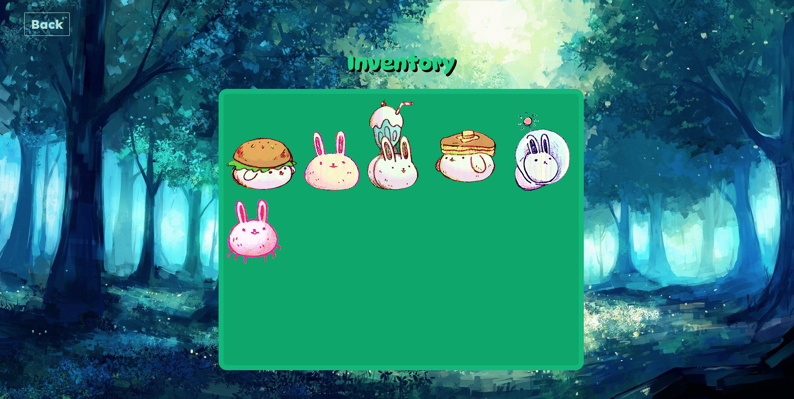
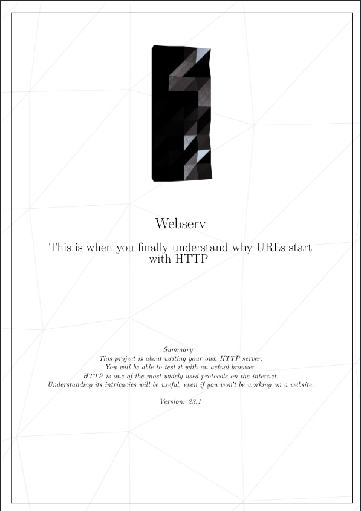

# Projet WEBSERV

<p align="center">
  
</p>
<table>
  <tr>
    <td style="padding: 0 3px 0 0; margin: 0;"></td>
    <td style="padding: 0 0 0 3px; margin: 0;"></td>
  </tr>
</table>

## Sommaire :
* Introduction
* Utilisation
* Architecture
* Fonctionnalités
* Liens

<p>&nbsp;</p>

## Introduction

Le projet Webserv consiste à créer un serveur HTTP fonctionnel en C++ capable de traiter les requêtes des clients et de servir des fichiers statiques ainsi que des scripts CGI.

Ce projet met l'accent sur la compréhension des protocoles réseau, la gestion multi-clients avec `epoll()`, et l'implémentation d'un serveur web respectant les standards HTTP.

### Objectifs principaux

- Créer un serveur HTTP entièrement fonctionnel en C++
- Gérer plusieurs clients simultanément sans bloquer (avec `epoll()`)
- Parser un fichier de configuration personnalisé
- Servir des fichiers statiques (HTML, CSS, images, etc.)
- Exécuter des scripts CGI (PHP, Python, Perl, etc.)
- Gérer les erreurs HTTP et les codes de statut appropriés
- Implémenter les méthodes HTTP GET, POST, DELETE

<p>&nbsp;</p>

## Utilisation

### Compilation

Compilez le projet avec `make` :

```bash
cd webserv
make
```

Cela générera un exécutable `webserv` à la racine du projet.

### Lancement du serveur

Lancez le serveur avec un fichier de configuration :

```bash
./webserv config/webserv.conf
```

Ou avec la configuration de test :

```bash
./webserv config/webserv_test.conf
```

Si aucun fichier n'est spécifié, le serveur utilise la configuration par défaut.

### Accès au serveur

Une fois lancé, vous pouvez accéder au serveur via votre navigateur :

```
site.com → http://localhost:4246
bunny.com → http://localhost:4247
```

### Structure de la configuration

Le fichier `webserv.conf` contient :

- **Serveurs** : Définition de plusieurs serveurs avec ports et domaines
- **Localisation** : Routes avec des méthodes HTTP autorisées
- **Fichiers d'erreur personnalisés** : Pages d'erreur custom (404, 500, etc.)
- **Scripts CGI** : Extensions autorisées et chemins vers les interpréteurs

Exemple simplifié :

```conf
server {
    listen 4246;
    server_name localhost;
    root ./www/site;
    
    location / {
        allow_methods GET POST;
        index index.html;
    }
    
    location /cgi-bin {
        allow_methods GET POST;
        cgi_pass .php /usr/bin/php-cgi;
        cgi_pass .py /usr/bin/python3;
    }
    
    error_page 404 ./error/404.html;
    error_page 500 ./error/500.html;
}
```

<p>&nbsp;</p>

## Architecture

### Structure du projet

```
webserv/
├── Makefile
├── webserv                    # Exécutable
├── config/
│   ├── webserv.conf         # Configuration principale
│   └── webserv_test.conf    # Configuration de test
├── inc/                       # Headers
│   ├── ServerMonitor.hpp
│   ├── Signal.hpp
│   ├── style.hpp
│   ├── config/
│   │   ├── ConfigParser.hpp
│   │   ├── Location.hpp
│   │   ├── ParserTools.hpp
│   │   └── ServerConf.hpp
│   ├── messages/
│   │   ├── CGI.hpp
│   │   ├── Request.hpp
│   │   └── Response.hpp
│   └── network/
│       ├── Client.hpp
│       ├── Epoll.hpp
│       ├── Server.hpp
│       └── Socket.hpp
├── src/                       # Implémentations
│   ├── main.cpp
│   ├── ServerMonitor.cpp
│   ├── Signal.cpp
│   ├── config/
│   ├── messages/
│   └── network/
├── obj/                       # Fichiers objets (générés)
├── ressources/                # Ressources du projet
└── www/                       # Contenu serveur
    ├── site/                 # Site principal
    ├── sandbox/              # Zone de test
    ├── cgi-bin/             # Scripts CGI
    └── bunnies/             # Application bonus
```

### Composants principaux

#### **Network**
- `Socket.hpp/cpp` : Gestion des sockets TCP/IP
- `Server.hpp/cpp` : Serveur principal, gestion des connexions
- `Epoll.hpp/cpp` : Multiplexage E/S avec `epoll()`
- `Client.hpp/cpp` : Représentation d'un client connecté

#### **Messages HTTP**
- `Request.hpp/cpp` : Parsing des requêtes HTTP
- `Response.hpp/cpp` : Construction des réponses HTTP
- `CGI.hpp/cpp` : Exécution et gestion des scripts CGI

#### **Configuration**
- `ConfigParser.hpp/cpp` : Parser du fichier `.conf`
- `ServerConf.hpp/cpp` : Représentation de la configuration serveur
- `Location.hpp/cpp` : Gestion des routes et permissions
- `ParserTools.hpp/cpp` : Outils utilitaires de parsing

#### **Monitoring**
- `ServerMonitor.hpp/cpp` : Surveillance et gestion du serveur
- `Signal.hpp/cpp` : Gestion des signaux (SIGINT, SIGTERM)

<p>&nbsp;</p>

## Fonctionnalités

### Serveur HTTP

✅ Servir des fichiers statiques (HTML, CSS, images, etc.)  
✅ Gérer plusieurs clients simultanément sans blocker  
✅ Parser les requêtes HTTP GET, POST, DELETE  
✅ Retourner les codes de statut HTTP appropriés  
✅ Gérer les erreurs avec des pages custom  

### Configuration personnalisée

✅ Fichier de configuration `.conf` flexible  
✅ Définir plusieurs serveurs sur différents ports  
✅ Configurer les routes (locations) avec permissions  
✅ Spécifier les fichiers d'erreur personnalisés  

### Scripts CGI

✅ Exécuter des scripts PHP, Python, Perl, Bash  
✅ Passer les paramètres POST/GET aux scripts  
✅ Capturer la sortie et la retourner au client  
✅ Gérer les timeouts et les erreurs d'exécution  

### Sécurité

✅ Utiliser `epoll()` pour éviter les blocages  
✅ Gérer les connexions lentes sans perte de clients rapides  
✅ Valider les requêtes malveillantes  
✅ Limiter la taille des uploads  

<p>&nbsp;</p>

### Test avec des scripts CGI

```bash
curl -X POST http://localhost:4246/cgi-bin/helloWorld.php
curl http://localhost:4246/cgi-bin/helloWorld.py?name=John
```

### Test de fichiers multiples

```bash
curl http://localhost:4246/index.html
curl http://localhost:4246/assets/css/style.css
curl http://localhost:4246/assets/images/logo.png
```

### Test des erreurs

```bash
curl http://localhost:4246/404_not_found          # Erreur 404
curl -X DELETE http://localhost:4246/              # Erreur 405 (méthode non autorisée)
```

### Test avec le visualizer (bonus)

L'application **bunnies** offre une interface interactive :

```bash
# Consultez le fichier www/bunnies/hunt.py pour les détails
```

<p>&nbsp;</p>

## Commandes utiles

### Compilation

```bash
make              # Compile le projet
make clean        # Supprime les fichiers objets
make fclean       # Supprime les fichiers objets et l'exécutable
make re           # Recompile complètement
```

### Debugging

```bash
# Voir les logs en détail
./webserv config/webserv.conf 2>&1 | tee server.log

# Tester une requête spécifique
curl -v http://localhost:4246/

# Voir les sockets ouvertes
lsof -i :4246

# Tuer le processus serveur
pkill -f webserv
```

### Inspection du serveur

```bash
# Vérifier que le serveur écoute
netstat -tuln | grep 4246

# Suivre les connexions en temps réel
watch -n 1 'netstat -tuln | grep 4246'
```

<p>&nbsp;</p>

## Améliorations et features bonus

- 🎨 **Interface web interactive** (application bunnies)
- 🔐 **Support HTTPS/SSL**
- ⚡ **Optimisation des performances**
- 📊 **Logs détaillés des requêtes**
- 🎯 **Redirection HTTP personnalisée**
- 📤 **Upload de fichiers**
- 🔄 **Keep-alive connections**

<p>&nbsp;</p>

## Liens

- [RFC 7230 - HTTP/1.1 Message Syntax](https://tools.ietf.org/html/rfc7230)
- [RFC 3875 - CGI Specification](https://tools.ietf.org/html/rfc3875)
- [Epoll documentation](https://man7.org/linux/man-pages/man7/epoll.7.html)
- [C++ Network Programming](https://en.cppreference.com/)
- [HTTP Status Codes](https://httpwg.org/specs/rfc7231.html#status.codes)

---

*Réalisé avec ❤️ par Ilyana Megy et Elia Khaled*

<p align="center">
  <a href="./ressources/en.subject.pdf">
    
  </a>
</p>
