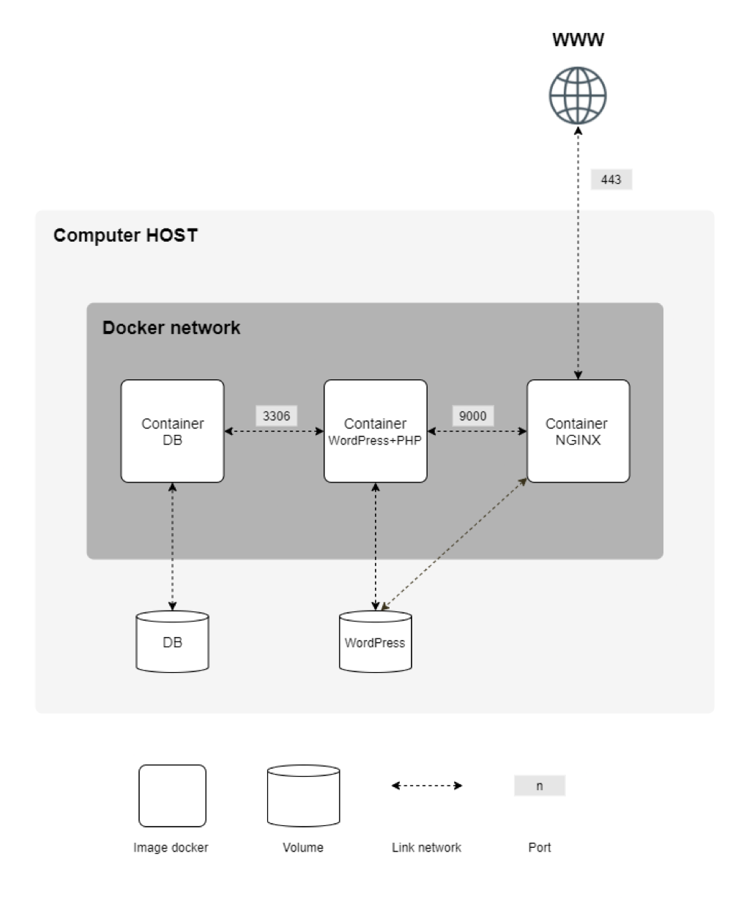
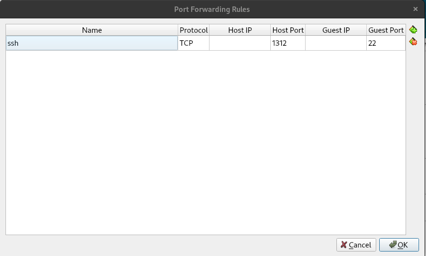
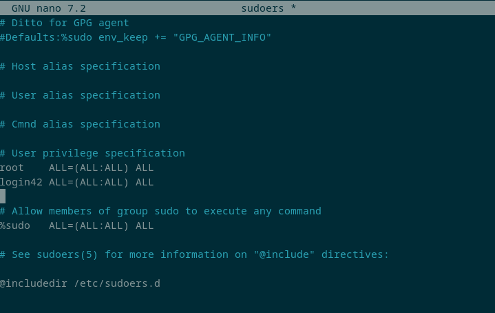
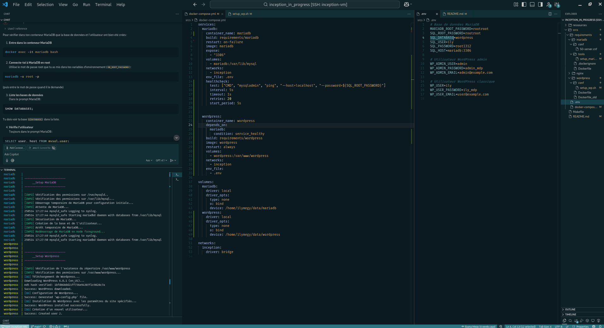
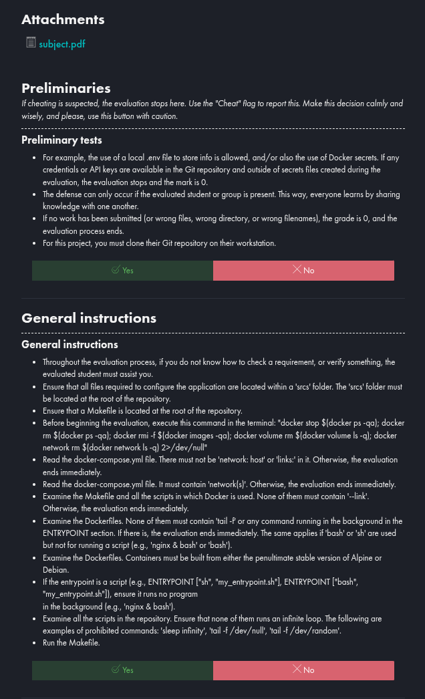
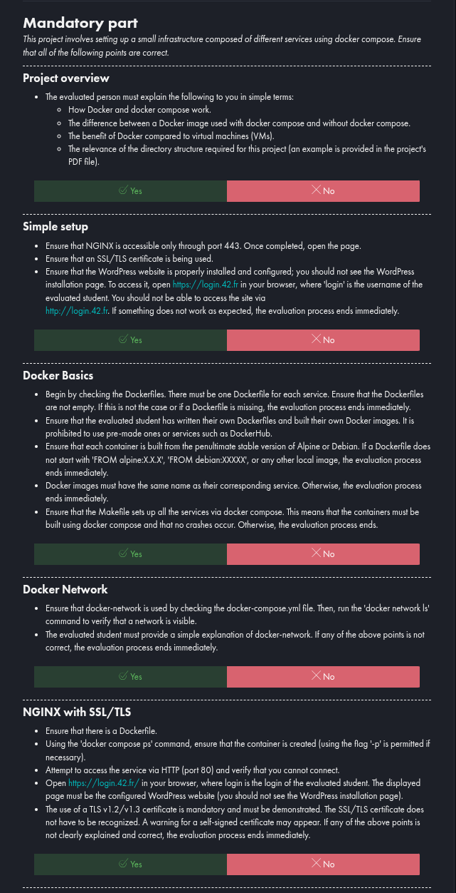
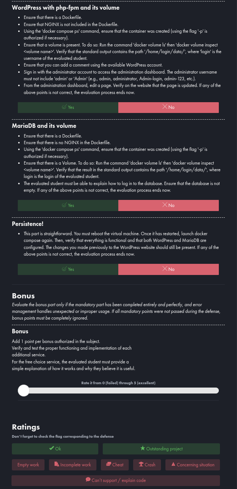

# Projet INCEPTION

<p align="center">
  
</p>

---

### **Introduction**
Le projet **Inception** consiste à créer une infrastructure basée sur Docker, permettant de déployer plusieurs services conteneurisés (NGINX, WordPress, MariaDB) tout en respectant les bonnes pratiques de déploiement. Ce projet met en avant l'utilisation de Docker et Docker Compose pour orchestrer des conteneurs.

---

### **1. Comprendre Docker**
Docker est un outil qui permet d'empaqueter une application et ses dépendances dans un conteneur isolé. Voici les problèmes que Docker résout :
- Une dépendance n’est pas compatible avec votre version de logiciel.
- Vous possédez déjà la dépendance, mais dans une version différente.
- Votre dépendance n’existe pas sur votre système d’exploitation.
- Votre dépendance crash au lancement.

#### **Pourquoi utiliser Docker ?**
- Docker permet de modéliser chaque conteneur sous forme d'image, stockable localement ou sur Docker Hub.
- Un conteneur est une machine virtuelle légère, sans noyau complet, contenant uniquement l'application et ses dépendances.

#### **Docker Hub**
Docker Hub est une plateforme où sont stockées des images Docker prêtes à l'emploi. Par exemple, pour installer NGINX, il suffit de récupérer l'image officielle sur Docker Hub.

#### **Exemple de Dockerfile**
Un fichier `Dockerfile` est utilisé pour définir une image Docker. Voici un exemple pour NGINX :
```dockerfile
FROM alpine:3.12

RUN apk update && apk upgrade && apk add \
    openssl nginx curl vim sudo

COPY ./config/nginx.conf /etc/nginx/nginx.conf
COPY scripts/setup_nginx.sh /setup_nginx.sh

RUN chmod -R +x /setup_nginx.sh

EXPOSE 443

ENTRYPOINT ["sh", "setup_nginx.sh"]
```

---

### **2. Concepts clés de Docker**
- **FROM** : Définit l'image de base (ex. `debian:buster` ou `alpine:3.12`).
- **RUN** : Exécute des commandes dans le conteneur.
- **COPY** : Copie des fichiers locaux dans le conteneur.
- **EXPOSE** : Définit les ports réseau accessibles entre conteneurs.
- **ENTRYPOINT** : Définit la commande à exécuter au démarrage  contdueneur.

---

### **3. Comprendre Docker Compose**
Docker Compose est un outil permettant de définir et gérer des applications multi-conteneurs via un fichier YAML. Il facilite la gestion des services et leur communication.

#### **Exemple de fichier `docker-compose.yml` basique**
```yml
version: '3.8'

services:
  nginx:
    image: nginx
    ports:
      - "443:443"
    networks:
      - inception_network

  wordpress:
    image: wordpress
    environment:
      WORDPRESS_DB_HOST: mysql
      WORDPRESS_DB_USER: user
      WORDPRESS_DB_PASSWORD: password
    networks:
      - inception_network

  mysql:
    image: mysql
    environment:
      MYSQL_ROOT_PASSWORD: rootpassword
      MYSQL_DATABASE: wordpress
      MYSQL_USER: user
      MYSQL_PASSWORD: password
    networks:
      - inception_network

networks:
  inception_network:
```

apres ca reste assez explicite

---

### **4. Comprendre le sujet**
#### **Services à mettre en place :**
- **NGINX** : Serveur web avec TLS v1.2 ou v1.3.
- **WordPress** : CMS avec PHP-FPM configuré.
- **MariaDB** : Base de données (sans NGINX).

#### **Volumes à configurer :**
- Volume pour la base de données WordPress.
- Volume pour les fichiers du site WordPress.

C’est un prérequis du sujet. Nous devons permettre la persistance des données, pour cela nous allons stocker certains dossiers directement sur notre ordinateur en local.

> Et oui, imagine que ton container WordPress crash ou s’éteint, et que par pur hasard, celui-ci a perdu tous tes fichiers, relou un peu. c’est pour cela qu'on les stockera directement en local, et docker-compose nous le permet.

Dans le cas d’Inception, nous allons stocker les dossiers de MySQL se trouvant dans `/var/lib/mysql`  et WordPress dans `var/www/wordpress`. Ceux sont les paths que j’indique après la ligne volume dans la partie `services` de mon fichier `docker-compose.yml`. Encore une fois c’est le sujet qui nous le demande.

Ces volumes doivent être disponibles dans le dossier `/home/<login>/data` de ta VM.
```yml
volumes:
  mariadb:
    driver: local
    driver_opts:
      type: none
      o: bind
      device: /home/<login>/data/mariadb
  wordpress:
    driver: local
    driver_opts:
      type: none
      o: bind
      device: /home/<login>/data/wordpress
```

#### **Réseau Docker :**
Un réseau Docker doit être configuré pour permettre la communication entre les conteneurs.

#### **Utilisateurs à créer :**
- Un utilisateur **Admin** (ne doit pas s’appeler "admin").
- Un utilisateur standard.

#### **Exigences pour NGINX :**
- NGINX doit être le seul point d’entrée de l’infrastructure via le port 443.
- Utilisation du protocole TLS pour sécuriser les échanges.

---
<p align="center">
  
</p>

---

### **5. Structure du projet**
Voici la structure attendue pour le projet :
```bash
$> ls -alR

Makefile
srcs/
  docker-compose.yml
  .env
  requirements/
    mariadb/
      Dockerfile
      .dockerignore
      conf/
      tools/
    nginx/
      Dockerfile
      .dockerignore
      conf/
      tools/
    wordpress/
      Dockerfile
      .dockerignore
      conf/
      tools/
```

#### **Détails des dossiers :**
- **conf/** : Contient les fichiers de configuration (ex. `nginx.conf`).
- **tools/** : Contient des scripts ou outils nécessaires.
- **.dockerignore** : Fichiers à ignorer par Docker.

---

### **6. Installation sur VM**

Télécharge l'iso de Debian ici https://www.debian.org/download
Quand l'installation est fini pense au port Forwarding pour te connecter à ta VM en ssh.

<p align="center">
  
</p>

🐙 **DANS TA VM !!**

Installe dans cet ordre : 

Tu peux déjà commencer par ajouter les droits sudo à ton user perso !
```bash
su
nano /etc/sudoers
```
<p align="center">
  
</p>
Ajoute ton user perso sous celui de root, ensuite sauvegarde et quitte avec `CTRL + X`, `Y` puis `ENTREE`.

Maintenant ajoute ton user au groupe sudo avec cette commande

```bash
usermod -aG sudo <username>
groups <username>               // pour vérifier que tu es bien dans le groupe sudo
```
Ok carré maintenant on va installer SSH pour pouvoir se connecter à ta VM depuis ton PC local (et pas que depuis l'interface de VirtualBox)

```bash
sudo apt-get update -y && sudo apt-get upgrade -y
sudo apt-get install openssh-server
sudo systemctl enable ssh
sudo systemctl restart ssh
```

Go dans le dossier racine
```bash
cd ~
ssh-keygen -t rsa -b 4096 -C "ton_mail@ultimateBG.com"
cd .ssh
ls
```
ajoute la cle .pub a ton github pour pouvoir clone ton projet :)

🐥 **SUR TON PC LOCAL**

Ok, pour lâcher l'interface de ta VM normalement t'as juste à partager la clé SSH de ton PC local (le physique quoi) avec ta VM.  
Pour ça, rends-toi dans le dossier `.ssh` à la racine (`cd ~/.ssh`).  
S'il n'existe pas (chelou quand même), crée-le et génère une clé SSH avec la même commande que sur ta VM :

```bash
cd ~
ssh-keygen -t rsa -b 4096 -C "ton_mail@ultimateBG.com"
cd .ssh
cat id_****.pub
```

Garde-la de côté pour l'instant on va tenter la connexion sur ta VM avec la commande `ssh`

```bash
ssh -p 1312 <username>@127.0.0.1
```

Si tout s'est bien passé félicitations vous êtes en direct de la VM pour inception
Go aller dans le dossier `.ssh` et créer ce fichier la : `authorized_keys`. Dedans tu colles la clé ssh .pub de ton PC local que t'as précieusement gardé !

Ok on est bon pour le partage de clés tu pourras maintenant manipuler facilement le terminal de ta VM et copier-coller tes commandes en remote sans embrouilles

MAIS. pour un confort plus ultra de la moooort, utilise ces extensions sur VSCode
- `Remote - SSH` 
  - https://marketplace.visualstudio.com/items?itemName=ms-vscode-remote.remote-ssh
  - https://marketplace.visualstudio.com/items?itemName=ms-vscode-remote.remote-ssh-edit
  - https://marketplace.visualstudio.com/items?itemName=ms-vscode.remote-explorer
- `VirtualBox` (https://marketplace.visualstudio.com/items?itemName=acherkashin.virtualbox-extension)

voilà c’est pour moi c’est cadeau ❤️  
Non, en vrai, regardez le setup, c’est optiii 

<p align="center">
  
</p>

bon pour comment le config demande au pote chatgpt hein :) mais c'est pas compliqué promis !
le gros avantage sur VSCode c'est qu'une fois que t'as co ta VM tu ouvres un terminal et tu vas dans le dossier où tu vas coder inception et avec la commande `code --reuse-window .` tu pourras ouvrir l'`EXPLORER` et voir tous tes dossiers et fichiers sur la barre à côté mais aussi tu as toutes tes tabs voilà...

bref.

Maintenant installons certains outils utils (oui.)
- curl ⚙️
- omyzsh ✨⚙️
- git ⚙️

```bash
sudo apt-get install curl
sudo apt install zsh -y
chsh -s $(which zsh)
sudo apt-get install git
sh -c "$(curl -fsSL https://raw.githubusercontent.com/ohmyzsh/ohmyzsh/master/tools/install.sh)"
```

On est bon je pense, tu peux cloner ton repo inception depuis ton github sur ta VM 👯‍♂️

- Installe docker-compose
```bash
sudo curl -L "https://github.com/docker/compose/releases/latest/download/docker-compose-$(uname -s)-$(uname -m)" -o /usr/local/bin/docker-compose
sudo chmod +x /usr/local/bin/docker-compose
```

- Vérifie qu'il est bien installé avec
```bash
ls /usr/local/bin/docker-compose
```

> et optionnel tu peux ajouter docker-compose au `PATH` dans l'env avec
```bash
sudo ln -s /usr/local/bin/docker-compose /usr/bin/docker-compose
```

- On installe Docker aussi, ouais ben sinon ça marche pas tout seul ☀️

```bash
## Ça fait pas de mal
sudo apt update
sudo apt upgrade -y

sudo apt install -y  ca-certificates gnupg lsb-release

## Ajouter la clé GPG officielle de Docker
sudo mkdir -p /etc/apt/keyrings
curl -fsSL https://download.docker.com/linux/debian/gpg | sudo gpg --dearmor -o /etc/apt/keyrings/docker.gpg

## Ajouter le dépôt Docker
echo "deb [arch=$(dpkg --print-architecture) signed-by=/etc/apt/keyrings/docker.gpg] https://download.docker.com/linux/debian \
  $(lsb_release -cs) stable" | sudo tee /etc/apt/sources.list.d/docker.list > /dev/null
sudo apt update

## Installer Docker
sudo apt install -y docker-ce docker-ce-cli containerd.io docker-buildx-plugin docker-compose-plugin

## Vérification
docker --version
docker-compose --version
```

> 💤 oublie pas de créer les dossiers /home/<42login>/data/mariadb et /home/<42login>/data/wordpress sur ta VM pour pouvoir mount tes containers... ET CHECKE LES PERMISSIONS !
---

### **7. Ressources utiles**
- [Documentation officielle Docker](https://docs.docker.com/)
- [Docker Compose Guide](https://docs.docker.com/compose/)
- [Tutoriel GradeMe sur Inception](https://tuto.grademe.fr/inception/)
- [Exemple GitHub 1](https://github.com/Forstman1/inception)
- [Exemple GitHub 2](https://github.com/42Paris/inception)

---

### **-- PETIT MEMO --**
- clean bien tout ça après chaque déploiement pour rester propre 🫧
```bash
docker-compose down -v
docker rmi $(docker images -q)
sudo rm -rf /home/ilymegy/data/mariadb/*
sudo rm -rf /home/ilymegy/data/wordpress/*

sudo lsof -i :443                 # vérifie quel service utilise le port 443    
sudo systemctl restart docker     # libère tous les ports utilisés par Docker
```

- 🔁 restart it 🔁
```bash
docker-compose build
docker-compose up                 # lance tous les containers mais sinon...
docker run -it nginx              # pour lancer un container unique 
```

- mais aussi 😌
```bash
docker image ls                   # connaitre les images actuelles
docker ps                         # connaitre les containers actuelleent lancés
docker exec -it mariadb bash      # accède au container depuis ton terminal
docker logs wordpress             # pour voir tes logs d'erreurs
```

Petit conseil, voilà, juste comme ça hein, mais suis bien l'ordre MariaDB - WordPress - NGINX pour la création de tes conteneurs, et surtout teste-les un par un parce que des bugs t'en auras plein, crois-moi.

Bon courage 🫶

---

## 🙋 INSTANT QUESTIONS ⬇️
#### et merci Copilot <3

### -> MariaDB

> okok mon build MariaDB se lance bien, tout est good :)
> comment vérifier maintenant dans mon conteneur MariaDB que la base de données est bien créée avec les bons paramètres ?

Pour vérifier dans ton conteneur MariaDB que la base de données et l'utilisateur ont bien été créés :

1. **Entre dans le conteneur MariaDB**  
```bash
docker exec -it mariadb bash
```

2. **Connecte-toi à MariaDB en root**  
Utilise le mot de passe root que tu as mis dans tes variables d’environnement (`SQL_ROOT_PASSWORD`) :
```bash
mariadb -u root -p
```
(puis entre le mot de passe quand il le demande)

3. **Liste les bases de données**  
Dans le prompt MariaDB :
```sql
SHOW DATABASES;
```
Tu dois voir ta base `${SQL_DATABASE}` dans la liste.

4. **Vérifie l’utilisateur**  
Toujours dans le prompt MariaDB :
```sql
SELECT user, host FROM mysql.user;
```
Tu dois voir `${SQL_USER}` avec le bon hôte (`%`).

5. **Teste la connexion à la base**  
Toujours dans le prompt MariaDB :
```sql
USE ${SQL_DATABASE};
SHOW TABLES;
```
(Si la base est vide, il n’y aura pas de tables, c’est normal.)

**Pour sortir du prompt MariaDB** :  
```sql
exit
```

Si tu veux tester la connexion directement avec l’utilisateur créé :
```bash
mariadb -u ${SQL_USER} -p${SQL_PASSWORD} ${SQL_DATABASE}
```

Tu dois pouvoir te connecter sans erreur.

---

### -> WordPress

> okok mon build WordPress se lance bien, tout est good :) 
> comment vérifier dans le conteneur WordPress que la config est parfaitement installée ?

Pour vérifier dans le conteneur **WordPress** que la configuration est bien complétée :

1. **Entre dans le conteneur WordPress**  
```bash
docker exec -it wordpress bash
```

2. **Vérifie la présence des fichiers WordPress**  
```bash
ls -l /var/www/wordpress
```
Tu dois voir les fichiers et dossiers WordPress (`wp-config.php`, `wp-admin`, `wp-content`, etc.).

3. **Vérifie la configuration de la base de données**  
Ouvre le fichier de config :
```bash
cat /var/www/wordpress/wp-config.php
```
Vérifie que les lignes suivantes correspondent à tes variables d’environnement :
- `DB_NAME`
- `DB_USER`
- `DB_PASSWORD`
- `DB_HOST`

4. **Teste la connexion à la base via WP-CLI**  
Toujours dans le conteneur :
```bash
wp core is-installed --allow-root --path=/var/www/wordpress
```
Si la sortie est vide, c’est que WordPress est bien installé.

5. **Vérifie les utilisateurs WordPress**  
```bash
wp user list --allow-root --path=/var/www/wordpress
```
Tu dois voir l’admin et l’auteur créés.

Si tout ça est OK, la configuration est complète !

---

### -> NGINX

> okok mon build NGINX se lance bien, tout est good :) 
> comment vérifier dans le conteneur NGINX que la config est parfaitement installée ?

Pour vérifier que tout est OK dans le conteneur **nginx** :

1. **Entre dans le conteneur nginx**  
```bash
docker exec -it nginx bash
```

2. **Teste la configuration NGINX**  
Dans le conteneur, lance :
```bash
nginx -t
```
Tu dois voir :  
`nginx: configuration file nginx.conf test is successful`

3. **Vérifie que le certificat SSL est bien présent**  
```bash
ls -l /etc/nginx/ssl/
```
Tu dois voir `inception.crt` et `inception.key`.

4. **Vérifie que le dossier WordPress est monté**  
```bash
ls -l /var/www/wordpress
```
Tu dois voir les fichiers WordPress.

5. **Teste l’accès à la page d’état**  
Toujours dans le conteneur :
```bash
curl -k https://localhost/status
```
Tu dois voir `OK`.

---

**Si tout ça fonctionne, ta config NGINX est OK !**

## FINAL 🏁

Normalement a ce stade tu devrais pouvoir acceder a l'interface web Wordpress depuis un navigateur sur **ta VM** en allant a l'adresse de ton domain (http://<login>.42.fr).

### Comment faire ?

**Vérifie que tes conteneurs tournent bien**  

```bash
➜  srcs git:(main) ✗ docker ps
CONTAINER ID   IMAGE       COMMAND                  CREATED          STATUS                    PORTS                                     NAMES
7b4a28cc9eb2   nginx       "nginx -g 'daemon of…"   21 minutes ago   Up 21 minutes             0.0.0.0:443->443/tcp, [::]:443->443/tcp   nginx
327a835dbcba   wordpress   "/setup_wp.sh"           22 minutes ago   Up 21 minutes             9000/tcp                                  wordpress
fd6604eb6e04   mariadb     "bash ./setup_mariad…"   22 minutes ago   Up 21 minutes (healthy)   3306/tcp                                  mariadb
```
Tu dois voir `nginx`, `wordpress`, `mariadb` en statut "Up".

4. **Si tu as défini un nom de domaine (ex: `<login>.42.fr`)**  
Ajoute-le dans ton `/etc/hosts` pour le faire pointer sur `127.0.0.1` 
```
127.0.0.1 <login>.42.fr localhost
```
Puis accède à :
```
https://<login>.42.fr
```

5. **Ignore l’avertissement SSL**  
Ton certificat est auto-signé, donc ton navigateur affichera un avertissement de sécurité. Clique sur "Avancé" puis "Continuer quand même".

READY TO PUSH ?

Ajoute quand meme ces lignes dans les `.dockerignore` :
```
../.env
../.gitignore
../.git
```

--- 

### **7. Correction**

Petit cadeau parce que je suis un amour ❤️
<p align="center">
  
  
  
</p>
